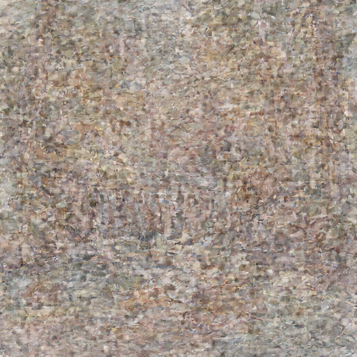
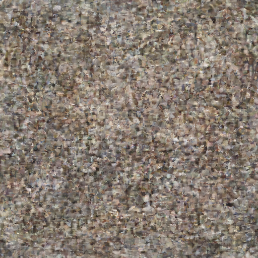
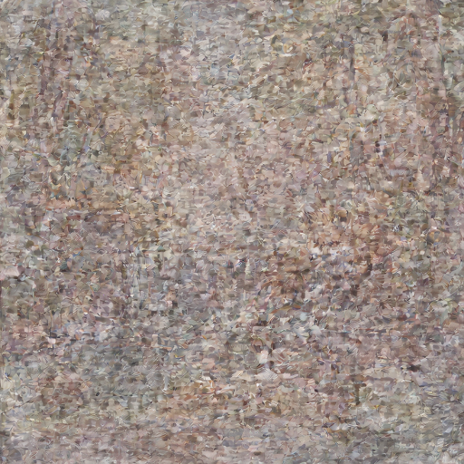
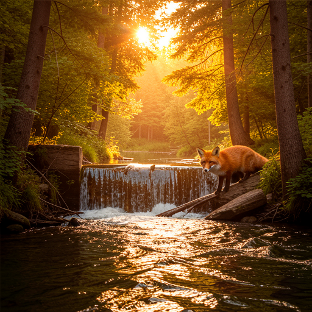
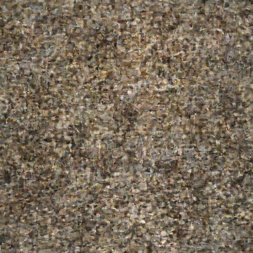
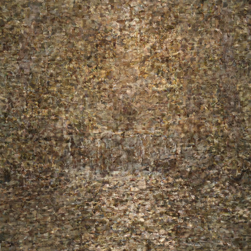

# Flux.2 Klein 9B KV Examples

Examples generated with **Flux.2 Klein 9B KV** on Mac with MLX, demonstrating **KV-cached denoising** for faster image-to-image generation.

## Model Specifications

| Feature | Value |
|---------|-------|
| Parameters | 9B |
| Architecture | 8 double + 24 single blocks (same as Klein 9B) |
| Default Steps | 4 (distilled) |
| Default Guidance | 1.0 |
| Text Encoder | Qwen3-8B |
| KV Cache | Step 0 extracts, steps 1-3 reuse (~2.66x I2I speedup) |
| License | Non-commercial |

> **What is Klein 9B KV?** This model variant is optimized for multi-reference image editing. On step 0, it extracts K/V tensors from reference tokens into a cache. Steps 1-3 reuse the cached KV, skipping reference re-processing entirely. This provides a ~2.66x speedup for I2I with multiple reference images.

---

## Use Case: Iterative Image Editing

This example demonstrates a typical creative workflow with **two editing axes**:
- **Style axis**: change the visual style while keeping the same subject
- **Subject axis**: swap the subject while preserving style and setting

```
           ┌─────────────────┐
           │  1. T2I: Beaver  │  (base image)
           │  photo, 17.8s    │
           └──────┬──────┬───┘
      style axis  │      │  subject axis
                  ▼      ▼
    ┌──────────────┐  ┌──────────────┐
    │ 2. Watercolor │  │ 4. Fox photo │
    │ beaver, 23.8s │  │ 22.9s        │
    └──────┬───────┘  └──────────────┘
           │  subject axis
           ▼
    ┌──────────────┐
    │ 3. Watercolor │
    │ fox, 25.2s    │
    └──────────────┘
```

---

### Step 1: Text-to-Image — Base Image

**Prompt:** `"a beaver building a dam in a forest river, golden hour sunlight filtering through trees"`

**Parameters:**
- Size: 512x512
- Steps: 4
- Guidance: 1.0
- Seed: 42


**Command:**
```bash
flux2 t2i "a beaver building a dam in a forest river, golden hour sunlight filtering through trees" \
  --model klein-9b-kv \
  --width 512 --height 512 \
  --seed 42 \
  -o beaver_512.png
```

**Performance:**
| Metric | Value |
|--------|-------|
| Total time | **17.8s** |
| Denoising | 13.4s (3.36s/step avg) |
| Text encoder load | 1.3s |
| Transformer load | 1.4s |
| VAE decode | 0.5s |

---

### Step 2: I2I Style Transfer — Watercolor (from Step 1)

**Reference:** `beaver_512.png` (from Step 1)

**Prompt:** `"transform into a watercolor painting with soft pastel colors and visible brushstrokes"`

| Input (Photo) | Output (Watercolor) |
|---------------|---------------------|
|  |  |

#### I2I Progression (KV-Cached)

| Step 2 (cached) | Step 3 (cached) | Final Step 4 (cached) |
|------------------|------------------|----------------------|
|  |  |  |

> Step 1 is the KV extraction pass (5.9s). Steps 2-4 use cached KV (~3.9s each).

**Command:**
```bash
flux2 i2i "transform into a watercolor painting with soft pastel colors and visible brushstrokes" \
  --model klein-9b-kv \
  --images beaver_512.png \
  --seed 123 \
  -o beaver_watercolor.png
```

**Performance:**
| Metric | Value |
|--------|-------|
| Total time | **23.8s** |
| Denoising (KV-cached) | 17.8s |
| Step 0 (KV extraction) | 5.9s (32 layers cached) |
| Steps 1-3 (cached) | ~3.9s each |

---

### Step 3: I2I Subject Swap — Fox Watercolor (from Step 2)

**Reference:** `beaver_watercolor.png` (from Step 2)

**Prompt:** `"replace the beaver with a fox, keep the same watercolor painting style and forest river setting"`

| Input (Beaver Watercolor) | Output (Fox Watercolor) |
|---------------------------|------------------------|
|  |  |

#### I2I Progression (KV-Cached)

| Step 2 (cached) | Step 3 (cached) | Final Step 4 (cached) |
|------------------|------------------|----------------------|
|  |  |  |

**Command:**
```bash
flux2 i2i "replace the beaver with a fox, keep the same watercolor painting style and forest river setting" \
  --model klein-9b-kv \
  --images beaver_watercolor.png \
  --seed 456 \
  -o fox_watercolor.png
```

**Performance:**
| Metric | Value |
|--------|-------|
| Total time | **25.2s** |
| Denoising (KV-cached) | 19.2s |
| Step 0 (KV extraction) | 6.4s (32 layers cached) |
| Steps 1-3 (cached) | ~4.1s each |

---

### Step 4: I2I Subject Swap — Fox Photo (from Step 1)

**Reference:** `beaver_512.png` (from Step 1 — the original photo)

**Prompt:** `"replace the beaver with a fox, keep the same forest river setting and golden hour lighting"`

| Input (Beaver Photo) | Output (Fox Photo) |
|----------------------|-------------------|
|  |  |

#### I2I Progression (KV-Cached)

| Step 2 (cached) | Step 3 (cached) | Final Step 4 (cached) |
|------------------|------------------|----------------------|
|  |  |  |

**Command:**
```bash
flux2 i2i "replace the beaver with a fox, keep the same forest river setting and golden hour lighting" \
  --model klein-9b-kv \
  --images beaver_512.png \
  --seed 789 \
  -o fox_photo.png
```

**Performance:**
| Metric | Value |
|--------|-------|
| Total time | **22.9s** |
| Denoising (KV-cached) | 17.0s |
| Step 0 (KV extraction) | 5.8s (32 layers cached) |
| Steps 1-3 (cached) | ~3.7s each |

---

## Complete Results Grid

|  | Beaver (original subject) | Fox (swapped subject) |
|--|---------------------------|----------------------|
| **Photo style** |  T2I — 17.8s |  I2I from 1 — 22.9s |
| **Watercolor style** |  I2I from 1 — 23.8s |  I2I from 2 — 25.2s |

---

## Performance Summary

### Timing Breakdown (512x512, 1 reference image, qint8 on-the-fly)

| Step | Operation | Denoising | Total | Mode |
|------|-----------|-----------|-------|------|
| 1 | T2I: Beaver photo | 13.4s | **17.8s** | Standard |
| 2 | I2I: Beaver watercolor | 17.8s | **23.8s** | KV-cached |
| 3 | I2I: Fox watercolor | 19.2s | **25.2s** | KV-cached |
| 4 | I2I: Fox photo | 17.0s | **22.9s** | KV-cached |

### KV-Cached Denoising Breakdown (average across 3 I2I runs)

| Phase | Time |
|-------|------|
| Step 0 (KV extraction) | **6.0s** (caches 32 layers) |
| Step 1 (cached) | **3.9s** |
| Step 2 (cached) | **3.9s** |
| Step 3 (cached) | **4.0s** |
| **Total denoising** | **17.8s** |

### Memory Usage

| Phase | GPU Memory |
|-------|-----------|
| Text Encoder (Qwen3-8B 8-bit) | 8,299 MB |
| After unload + cleanup | 24 MB |
| Transformer (qint8 on-the-fly) | 9,223 MB |
| Peak during quantization | 11,836 MB |

### Performance Report (I2I, representative run)

```
╔══════════════════════════════════════════════════════════════╗
║          FLUX.2 Klein 9B KV — I2I PERFORMANCE               ║
╠══════════════════════════════════════════════════════════════╣
📊 PHASE TIMINGS:
────────────────────────────────────────────────────────────────
  1. Load Text Encoder                1.3s    5.5%
  2. Text Encoding                    1.1s    4.6%
  3. Unload Text Encoder              36ms    0.2%
  4. Load Transformer                 1.4s    6.0%
  5. Load VAE                         19ms    0.1%
  6. Denoising Loop (KV-cached)      19.2s   82.0% ████████████████
  7. VAE Decode                      410ms    1.7%
  8. Post-processing                   6ms    0.0%
────────────────────────────────────────────────────────────────
  TOTAL                              23.5s  100.0%
╚══════════════════════════════════════════════════════════════╝
```

---

## CLI Commands Summary

```bash
# Text-to-Image with Klein 9B KV
flux2 t2i "a beaver building a dam" \
  --model klein-9b-kv \
  --width 512 --height 512

# Image-to-Image with KV-cached denoising (automatic when using klein-9b-kv)
flux2 i2i "transform into a watercolor painting" \
  --model klein-9b-kv \
  --images reference.png

# Subject swap preserving style
flux2 i2i "replace the beaver with a fox, keep the same style" \
  --model klein-9b-kv \
  --images watercolor_beaver.png

# Multi-reference I2I (where KV cache shines most)
flux2 i2i "a cat wearing the hat from image 2 and jacket from image 3" \
  --model klein-9b-kv \
  --images cat.png \
  --images hat.png \
  --images jacket.png
```

---

## Hardware

- **Machine:** Mac Studio (2023)
- **Chip:** Apple M2 Ultra
- **RAM:** 96 GB Unified Memory
- **macOS:** Tahoe 26.3
- **Transformer:** Klein 9B KV (bf16, quantized on-the-fly to qint8)
- **Text Encoder:** Qwen3-8B (8-bit)
